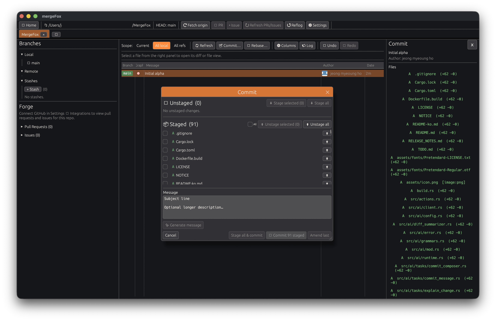

<p align="center">
  
</p>

<h1 align="center">mergeFox</h1>

<p align="center">
  <b>Lightweight native Git client — Rust + egui + gix + the system git binary.</b>
</p>

<p align="center">
  <b>알파 / Alpha</b> · <code>v0.1.0-alpha.1</code> · English / <a href="./README-ko.md">🇰🇷 한국어</a>
</p>

<p align="center">
  
</p>

---

## Overview

`mergeFox` is a lightweight desktop Git GUI focused on fast everyday use,
safer history rewriting, and built-in recovery tools.

- **Pure Rust UI** — no Electron, no WebView. egui + eframe (glow by default,
  wgpu on request).
- **gitoxide (`gix`) for the read path** — ref enumeration, graph walk,
  blob loading, commit metadata. Pure-Rust, parallel pack resolution.
- **System `git` for the write path** — commit, amend, rebase, merge,
  cherry-pick, revert, reset, stash, checkout, fetch, push, pull, clone.
  This means your local hooks (pre-commit, commit-msg, post-merge, …),
  signing keys, credential helpers, proxies, and custom mergetools all
  behave identically to running `git` in a terminal.
- **Undo / redo journal** — every state change is recorded; the
  `Cmd/Ctrl+Z` key is a first-class Git GUI feature.
- **Multi-tab workspace** — keep several repos open at once.

## Features at a glance

- Commit graph with branch / ref chips, author avatars (local identicons,
  no Gravatar round-trip), relative dates, and draggable column widths
- Interactive rebase (Tower-inspired UI) — Pick / Reword / Squash / Drop
  with reorder arrows, backup branch, live conflict resolver
- Conflict resolver — colour-coded sides, highlighted conflict-marker
  regions in the merged-result editor, Prev / Next navigation, Take Both
- Commit window with split **Unstaged / Staged** panels, per-file
  checkboxes, individual up/down arrows, bulk "stage selected" actions
- Stash — create with message, pop / apply / drop via sidebar context menu
- Inline diff viewer with virtualised file list and virtualised patch
  lines (handles kernel-scale merge commits without jank)
- Image diffs (PNG / JPG / GIF / WEBP / BMP …) via egui's image loader
- Large-file / LFS warning — sidebar flags binaries over 10 MB committed
  to the repo so users can migrate to LFS
- Panic recovery & reflog recovery — pick any past state and restore to a
  fresh branch so a bad rebase is never terminal
- AI-assisted commit messages (optional) — configure any
  OpenAI-compatible endpoint (OpenAI, Anthropic, Ollama, …)
- PR / issue creation via the configured forge (GitHub / GitLab /
  Bitbucket / Gitea / Codeberg)

## Status

This is the **first alpha** (`v0.1.0-alpha.1`). Core workflows are stable
enough for daily Git work; peripheral UI and some network flows are still
moving fast. See [RELEASE_NOTES.md](./RELEASE_NOTES.md) for the full
list, [TODO/features.md](./TODO/features.md) for feature gaps, and
[TODO/production.md](./TODO/production.md) for production-readiness work.

Known limitations in alpha:
- No blame view yet
- No line-by-line stage / unstage
- GPG signing respects your local git config but isn't exposed in the UI
- Git LFS uses the system smudge filter transparently; there's no
  dedicated LFS inspector yet

## Install / Run

### From source

```bash
git clone https://github.com/your-org/mergefox
cd mergefox
cargo run --release
```

Release binaries live at `target/release/mergefox` (or `.exe` on
Windows). The app looks for your system `git` on `PATH` at runtime.

### Requirements

- Recent stable Rust toolchain
- The system `git` binary (2.x or later)
- C/C++ toolchain for transitive native deps (ring / objc / …)

Per-platform hints:

- **macOS** — `xcode-select --install`
- **Linux** — `build-essential`, `pkg-config`, and your distro's
  desktop libraries (`libxkbcommon`, `libwayland`, `libx11`, …)
- **Windows** — MSVC Build Tools

`gix` ships pure-Rust; no external `libgit2` install is required.

## Usage

### 1. Open a repo

The Welcome / `+` tab has **Open** (local path) and **Clone**
(URL + destination) actions, plus a list of recent repos.

### 2. Browse the graph

The centre pane shows the commit graph. Click a commit to load its diff
on the right. Column widths are draggable. Right-click a commit for the
per-commit action menu (checkout, branch here, cherry-pick, revert,
reset, drop, create tag, copy SHA, …).

### 3. Commit

Toolbar **Commit…** opens the commit dialog with two panels:

- **Unstaged** — check files and hit `⬇ Stage selected`, or use the
  per-row arrow, or `⬇ Stage all`
- **Staged** — `⬆ Unstage selected` / per-row `⬆` / `⬆ Unstage all`
- Type a message (or press `✨ Generate` for an AI suggestion if an
  endpoint is configured), then **Commit staged** / **Amend last** /
  **Stage all & commit**

### 4. Rebase

Toolbar **Rebase…** opens the interactive rebase planner. Reorder with
↑ / ↓, pick an action per commit (Pick / Reword / Squash / Drop), check
`Backup current state with tag` if you want an escape hatch, then
**Rebase**. Conflicts open the resolver; resolve each file and press
**Continue**.

### 5. Stash

Sidebar **Stashes** section has `+ Stash` to create, double-click a
stash to pop, or right-click for Pop / Apply / Drop.

## Configuration

Everything lives under **Settings** (gear icon, top right):

- Language (English, Korean, Japanese, Chinese, French, Spanish, …)
- Theme (built-in palettes + custom accent / contrast / translucent
  panels)
- Default remote per repo, preferred pull strategy (merge / rebase /
  ff-only)
- Git provider accounts (GitHub / GitLab / Bitbucket / Gitea /
  Codeberg) via PAT or OAuth
- SSH key generation / import / public-key copy
- AI endpoint (any OpenAI-compatible URL) for commit-message generation

Credentials never leave your machine. They are stored via a
[`secrecy::SecretString`](https://docs.rs/secrecy)-backed layered store:

1. **OS keychain first** (macOS Keychain / Windows Credential Manager /
   Linux Secret Service), when the platform backend is available.
2. **Encrypted-at-rest file fallback** otherwise, at
   `~/Library/Application Support/mergefox/secrets.json` (macOS) or the
   equivalent config dir on other OSes. The file is permission-locked
   to the user (`0600`) and carries an in-file warning banner — anyone
   with read access to your home dir can read these tokens, so keep the
   usual file-permission hygiene.

`config.json` never contains secrets — only account handles that look
up the real value in the store.

## Performance notes

mergeFox is engineered for responsiveness on large repositories:

- The commit graph is built on a background thread via gix's parallel
  walker, then virtualised at paint time (only visible rows render).
- Every diff lookup is served from an LRU cache (recent 32 commits);
  flipping between two commits costs zero subprocesses.
- Rapid clicks are coalesced — at most one `git show` runs at a time,
  and intermediate clicks are dropped so the latest selection always
  wins.
- Per-frame git work is eliminated — conflict detection, remote lists,
  branch / stash / status listings are all snapshot-cached and only
  refreshed after an operation.

If something still feels sluggish, set `MERGEFOX_PROFILE_FRAMES=1` and
`MERGEFOX_PROFILE_DIFF=1` before running — the app will log per-frame
timings and diff-pipeline stage durations to stderr.

## Keyboard shortcuts

| Shortcut                       | Action                    |
|--------------------------------|---------------------------|
| `Cmd/Ctrl + Z`                 | Undo                      |
| `Cmd/Ctrl + Shift + Z`         | Redo                      |
| `Cmd/Ctrl + Shift + Esc`       | Open panic recovery       |
| `Ctrl + Tab`                   | Next tab                  |
| `Ctrl + Shift + Tab`           | Previous tab              |
| `Cmd/Ctrl + W`                 | Close current tab         |

## Environment variables

| Variable                        | Effect                                                  |
|---------------------------------|---------------------------------------------------------|
| `MERGEFOX_RENDERER=wgpu\|glow`   | Force renderer (default: `glow`)                        |
| `MERGEFOX_PROFILE_FRAMES=1`     | Log per-frame duration + inter-frame gap                |
| `MERGEFOX_PROFILE_DIFF=1`       | Log `diff_for_commit` timings and click-to-result       |
| `MERGEFOX_NO_AVATARS=1`         | Hide author identicons (perf A/B)                       |
| `MERGEFOX_STRAIGHT_LANES=1`     | Draw straight lanes instead of cubic beziers (perf A/B) |
| `MERGEFOX_FORCE_CONTINUOUS=1`   | Force 60 Hz rendering regardless of idle state          |

## Project structure

```text
src/
├── actions.rs        CommitAction enum (undoable user intents)
├── app.rs            Top-level app state, tabs, modals, background pollers
├── clone.rs          Async clone (gix first, git CLI fallback)
├── config.rs         Persisted settings + theme + AI endpoint
├── forge/            GitHub / GitLab / … REST clients + PR / issue models
├── git/
│   ├── cli.rs        Thin wrapper around the system `git` binary
│   ├── diff.rs       Structured RepoDiff + unified-diff parser
│   ├── graph.rs      CommitGraph with lane assignment
│   ├── jobs.rs       Fetch / push / pull background jobs
│   ├── lfs.rs        LFS candidate scanner
│   ├── ops.rs        Status / stage / commit / amend / stash
│   └── repo.rs       Repo wrapper over gix + CLI
├── journal/          Append-only operation journal + undo / redo
├── providers/        PAT storage, OAuth, SSH key management
├── secrets.rs        Layered credential store (OS keychain → file fallback)
├── ai/               Commit-message generation + AI task runner
└── ui/               egui views (graph, sidebar, commit_modal, rebase,
                       conflicts, settings, prompt, hud, …)
```

## License

Licensed under the [Apache License 2.0](./LICENSE).
See [NOTICE](./NOTICE) for third-party attributions.
