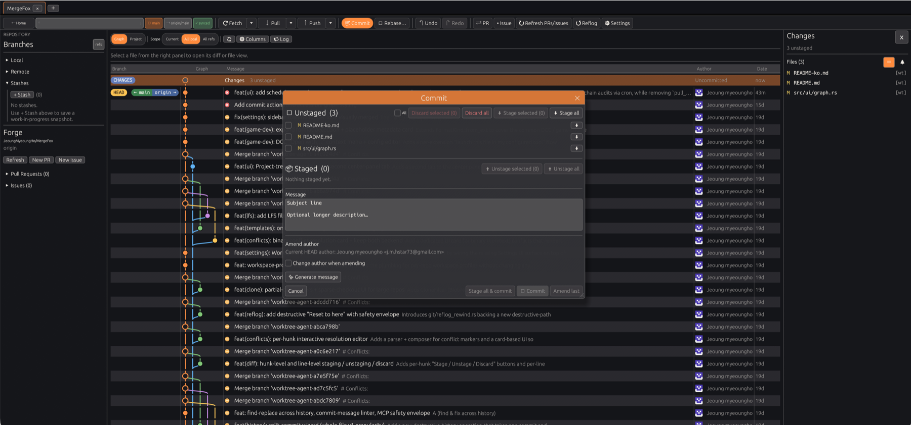

<p align="center">
  
</p>

<h1 align="center">mergeFox</h1>

<p align="center">
  <b>Lightweight native Git client — Rust + egui + gix + the system git binary.</b>
</p>

<p align="center">
  <b>알파 / Alpha</b> · <code>v0.1.0-alpha.2</code> · English / <a href="./README-ko.md">🇰🇷 한국어</a>
</p>

<p align="center">
  
</p>

---

## Overview

`mergeFox` is a lightweight desktop Git GUI focused on fast everyday use,
safer history rewriting, and built-in recovery tools.

- **Pure Rust UI** — no Electron, no WebView. egui + eframe (glow by default,
  wgpu on request).
- **gitoxide (`gix`) for the read path** — ref enumeration, graph walk,
  blob loading, commit metadata. Pure-Rust, parallel pack resolution.
- **System `git` for the write path** — commit, amend, rebase, merge,
  cherry-pick, revert, reset, stash, checkout, fetch, push, pull, clone.
  This means your local hooks (pre-commit, commit-msg, post-merge, …),
  signing keys, credential helpers, proxies, and custom mergetools all
  behave identically to running `git` in a terminal.
- **Undo / redo journal** — every state change is recorded; the
  `Cmd/Ctrl+Z` key is a first-class Git GUI feature.
- **Multi-tab workspace** — keep several repos open at once.

## Features at a glance

**UI / navigation**

- **Single unified top toolbar** — Fetch / Pull / Push / Commit (primary
  accent) / Rebase / Undo / Redo / PR / Issue / Reflog / Settings, all
  in one row, so every "do something" verb lives in one place. The
  center pane keeps just a view-controls strip (Graph ↔ Project
  segmented switcher, Scope segmented filter, Columns, Log).
- **Commit graph** with vibrant per-branch colours, halo'd commit dots
  (so lane lines never appear to pass through them), pill-shaped HEAD
  and branch chips, zebra striping, and a 3 px accent bar marking the
  selected commit. Hover is a desaturated tone-down of the theme accent
  so "hovering" reads distinctly from "selected."
- **Project tree tab** — flip the segmented switcher to browse the
  working tree as a file tree (filter, show-hidden toggle, click a file
  for its working-tree diff).
- **Command palette** (`⌘/Ctrl+K`) — fuzzy-search commands and recent
  commits.
- **Multi-tab workspace** — keep several repos open at once.
- **Multi-commit basket** — `⌘/Ctrl+click` commits to queue them, then
  cherry-pick / revert the whole set in one go.

**Commits & rewriting history**

- Commit window with split **Unstaged / Staged** panels, per-file
  checkboxes, individual ↑ / ↓ arrows, bulk "stage selected" actions
- **Hunk-level staging** — stage / unstage / discard individual diff
  hunks with `s` / `u` / `d` keys
- **Interactive rebase** — Pick / Reword / Squash / Drop with reorder
  arrows, optional backup tag, live conflict resolver
- **Conflict resolver** — colour-coded sides, highlighted conflict-
  marker regions, Prev / Next navigation, Take Both
- **Reword / Split** specialised flows for safe message edits and
  splitting a commit by file or hunk
- **Find / fix** for replaying small touch-up edits across a range of
  commits without a full rebase
- **Bisect** wizard for `git bisect`
- **Stash** — create with message, pop / apply / drop via sidebar
  context menu (or double-click to pop)
- **Author identicons** — local 5×5 symmetrical, no Gravatar round-trip

**Diff viewer**

- Virtualised file list and patch lines (kernel-scale merge commits
  render without jank)
- **Image diffs** (PNG / JPG / GIF / WEBP / BMP …) via egui's image
  loader
- **Diff minimap** for orientation in long patches
- **Blame view** — open from the file context menu

**Safety**

- **Undo / redo journal** — every state change is recorded;
  `⌘/Ctrl+Z` is a first-class git GUI gesture (auto-stashes a dirty
  working tree before reverting and restores it after)
- **Panic recovery** (`⌘/Ctrl+Shift+Esc`) — pick any past journal
  snapshot and restore to a fresh branch so a bad rebase is never
  terminal
- **Reflog recovery** (`⌘/Ctrl+Shift+R`) — browse recent HEAD moves
  with diff previews and recover onto a safe branch
- **Pre-flight modals** — destructive actions (hard reset, force push,
  delete branch, drop commit) show concrete numbers ("3 commits on
  `main` will be dropped") before they run

**Remote / forge**

- **Push / Pull / Fetch** with split-button strategy menus (Pull = merge
  / rebase / fast-forward only; Push = push / force-push with confirm)
- **Per-repo default remote** + preferred pull strategy
- **PR / issue creation and browsing** for GitHub / GitLab / Bitbucket /
  Gitea / Codeberg via PAT or OAuth device flow
- **CI status badges** on commit rows (forge check-run cache)
- **Git LFS** — sidebar flags binaries committed over 10 MB, plus
  optional **LFS lock** controls (lock / unlock / steal) for profiles
  that opt in
- **Worktree management** — list / add / lock / remove from
  Settings → Repository
- **Publish branch** modal for first-time push to a brand-new remote

**AI (optional)**

- Commit-message generation — configure any OpenAI-compatible endpoint
  (OpenAI, Anthropic, Ollama, self-hosted …)
- Diff summarisation, repo-convention sniffing, change-signal extraction

**MCP server (optional)**

- **Model Context Protocol stdio server** exposing read-only repo
  introspection + opt-in mutation tools to LLM agents. Token-gated; see
  `MERGEFOX_MCP_TOKEN` below.

## Status

This is the **second alpha** (`v0.1.0-alpha.2`). Core workflows are stable
enough for daily Git work; peripheral UI and some network flows are still
moving fast. See [RELEASE_NOTES.md](./RELEASE_NOTES.md) for the full
list, [TODO/features.md](./TODO/features.md) for feature gaps, and
[TODO/production.md](./TODO/production.md) for production-readiness work.

Known limitations in alpha:
- GPG signing respects your local git config but isn't exposed as a
  per-commit toggle in the UI yet
- Git LFS uses the system smudge filter transparently; LFS lock
  controls are exposed but there's no dedicated object-level inspector
- Binaries are not codesigned / notarised (you'll see Gatekeeper
  warnings on macOS — open the app once with right-click → Open)
- Some forge UI flows (Bitbucket / Azure DevOps PR review threads) are
  read-only for now

## Install / Run

### From source

```bash
git clone https://github.com/JeoungMyeoungHo/MergeFox
cd MergeFox
cargo run --release
```

Release binaries live at `target/release/mergefox` (or `.exe` on
Windows). The app looks for your system `git` on `PATH` at runtime.

### Requirements

- Recent stable Rust toolchain
- The system `git` binary (2.x or later)
- C/C++ toolchain for transitive native deps (ring / objc / …)

Per-platform hints:

- **macOS** — `xcode-select --install`
- **Linux** — `build-essential`, `pkg-config`, and your distro's
  desktop libraries (`libxkbcommon`, `libwayland`, `libx11`, …)
- **Windows** — MSVC Build Tools

`gix` ships pure-Rust; no external `libgit2` install is required.

## Usage

### 1. Open a repo

The Welcome / `+` tab has **Open** (local path) and **Clone**
(URL + destination) actions, plus a list of recent repos.

### 2. Browse the graph

The centre pane shows the commit graph. The view-controls strip above
the graph has a `Graph | Project` segmented switcher, a `Scope:
Current | All local | All refs` filter, and the Columns / Log toggles.
Click a commit to load its diff on the right; the active row gets the
accent fill plus a 3 px left bar so it stays visible as you scroll.
Right-click a commit for the per-commit action menu (checkout, branch
here, cherry-pick, revert, reset, drop, create tag, copy SHA, …).
`Cmd/Ctrl + click` toggles a commit in the multi-commit basket — handy
for cherry-pick / revert across several commits at once.

### 3. Commit

The top toolbar's **📝 Commit** (primary accent) button opens the
commit dialog with two panels:

- **Unstaged** — check files and hit `⬇ Stage selected`, or use the
  per-row arrow, or `⬇ Stage all`
- **Staged** — `⬆ Unstage selected` / per-row `⬆` / `⬆ Unstage all`
- Type a message (or press `✨ Generate` for an AI suggestion if an
  endpoint is configured), then **Commit staged** / **Amend last** /
  **Stage all & commit**

### 4. Rebase

The top toolbar's **⎇ Rebase…** button opens the interactive rebase
planner. Reorder with ↑ / ↓, pick an action per commit (Pick / Reword
/ Squash / Drop), check `Backup current state with tag` if you want an
escape hatch, then **Rebase**. Conflicts open the resolver; resolve
each file and press **Continue**.

### 5. Stash

Sidebar **Stashes** section has `+ Stash` to create, double-click a
stash to pop, or right-click for Pop / Apply / Drop.

### 6. Browse the working tree

Switch the segmented `Graph | Project` control above the center pane
to **Project**. The tree supports a substring filter (auto-expands
ancestors of matches), a `Show hidden` toggle, and click-to-diff for
the selected file against HEAD.

### 7. Command palette & undo

`⌘/Ctrl+K` opens a fuzzy palette over commands and recent commits.
Anything you do that mutates state (commit, stage, checkout, rebase,
…) is journaled — `⌘/Ctrl+Z` walks back through the journal,
auto-stashing any dirty working tree first and restoring it
afterwards.

## Configuration

Everything lives under **Settings** (gear icon, top right):

- Language (English, Korean, Japanese, Chinese, French, Spanish, …)
- Theme (built-in palettes + custom accent / contrast / translucent
  panels)
- Default remote per repo, preferred pull strategy (merge / rebase /
  ff-only)
- Git provider accounts (GitHub / GitLab / Bitbucket / Gitea / Codeberg
  / Azure DevOps) via PAT or OAuth device flow
- SSH key generation / import / public-key copy
- AI endpoint (any OpenAI-compatible URL) for commit-message generation
- Worktree management for the active repo (list / add / lock / remove)
- Workspace profile selection — the Settings UI surfaces only the
  controls relevant to your repo's profile (General vs LFS-heavy /
  large-binary / regulated)
- MCP server token (used by external LLM agents that connect over
  stdio)

Credentials never leave your machine. They are stored via a
[`secrecy::SecretString`](https://docs.rs/secrecy)-backed layered store:

1. **OS keychain first** (macOS Keychain / Windows Credential Manager /
   Linux Secret Service), when the platform backend is available.
2. **Encrypted-at-rest file fallback** otherwise, at
   `~/Library/Application Support/mergefox/secrets.json` (macOS) or the
   equivalent config dir on other OSes. The file is permission-locked
   to the user (`0600`) and carries an in-file warning banner — anyone
   with read access to your home dir can read these tokens, so keep the
   usual file-permission hygiene.

`config.json` never contains secrets — only account handles that look
up the real value in the store.

## Performance notes

mergeFox is engineered for responsiveness on large repositories:

- The commit graph is built on a background thread via gix's parallel
  walker, then virtualised at paint time (only visible rows render).
- Every diff lookup is served from an LRU cache (recent 32 commits);
  flipping between two commits costs zero subprocesses.
- Rapid clicks are coalesced — at most one `git show` runs at a time,
  and intermediate clicks are dropped so the latest selection always
  wins.
- Per-frame git work is eliminated — conflict detection, remote lists,
  branch / stash / status listings are all snapshot-cached and only
  refreshed after an operation.

If something still feels sluggish, set `MERGEFOX_PROFILE_FRAMES=1` and
`MERGEFOX_PROFILE_DIFF=1` before running — the app will log per-frame
timings and diff-pipeline stage durations to stderr.

## Keyboard shortcuts

Global (canonical list lives in `src/ui/shortcuts.rs`; press `?` in
the app to open the same cheat-sheet):

| Shortcut                       | Action                                  |
|--------------------------------|-----------------------------------------|
| `?` / `Shift + /`              | Open the keyboard cheat-sheet           |
| `Cmd/Ctrl + K`                 | Open the command palette                |
| `Ctrl + Tab`                   | Next workspace tab                      |
| `Ctrl + Shift + Tab`           | Previous workspace tab                  |
| `Cmd/Ctrl + W`                 | Close the active tab                    |
| `Cmd/Ctrl + Z`                 | Undo last mutating action               |
| `Cmd/Ctrl + Shift + Z`         | Redo                                    |
| `Cmd/Ctrl + Shift + R`         | Open reflog recovery                    |
| `Cmd/Ctrl + Shift + Esc`       | Open panic recovery                     |
| `Esc`                          | Close the topmost modal                 |

Diff-pane (active when a hunk is focused, no text field has focus):

| Shortcut | Action                              |
|----------|-------------------------------------|
| `s`      | Stage the focused hunk              |
| `u`      | Unstage the focused hunk            |
| `d`      | Discard the focused hunk            |

## Environment variables

Rendering / UI:

| Variable                        | Effect                                                  |
|---------------------------------|---------------------------------------------------------|
| `MERGEFOX_RENDERER=wgpu\|glow`  | Force renderer (default: `glow`)                        |
| `MERGEFOX_FORCE_CONTINUOUS=1`   | Force 60 Hz rendering regardless of idle state          |
| `MERGEFOX_NO_AVATARS=1`         | Hide author identicons (perf A/B)                       |
| `MERGEFOX_STRAIGHT_LANES=1`     | Draw straight lanes instead of cubic beziers (perf A/B) |

Logging / profiling:

| Variable                                 | Effect                                                 |
|------------------------------------------|--------------------------------------------------------|
| `MERGEFOX_LOG=mergefox::git::cli=debug`  | `tracing-subscriber` filter (any `RUST_LOG`-style spec)|
| `MERGEFOX_LOG_FORMAT=json\|text`         | Log emitter format (default: text)                     |
| `MERGEFOX_LOG_STDERR=1`                  | Mirror logs to stderr in addition to the log file      |
| `MERGEFOX_LOG_GIT=1`                     | Legacy shortcut for `mergefox::git::cli=debug`         |
| `MERGEFOX_LOG_AI_PROMPT=1`               | Include AI prompts (full text) in the log              |
| `MERGEFOX_PROFILE_FRAMES=1`              | Log per-frame duration + inter-frame gap               |
| `MERGEFOX_PROFILE_DIFF=1`                | Log `diff_for_commit` timings and click-to-result      |

Git operations / network:

| Variable                          | Effect                                                  |
|-----------------------------------|---------------------------------------------------------|
| `MERGEFOX_GIT_TIMEOUT_SECS=300`   | Override timeout for fetch / push / pull background jobs|
| `MERGEFOX_HTTP_USER` / `HTTP_PASS`| Inject HTTPS credentials for sandboxed test clones      |

MCP (Model Context Protocol stdio server):

| Variable                              | Effect                                                  |
|---------------------------------------|---------------------------------------------------------|
| `MERGEFOX_MCP_TOKEN=…`                | Token required by clients (empty = unauthenticated, dev)|
| `MERGEFOX_MCP_AUTO_APPROVE=1`         | Auto-approve mutation tools (dangerous; testing only)   |
| `MERGEFOX_MCP_ALLOW_DESTRUCTIVE=1`    | Allow destructive tool variants (force push, reset hard)|

## Project structure

```text
src/
├── actions.rs            CommitAction enum (undoable user intents)
├── app.rs                Top-level app state, tabs, modals, background pollers
├── clone.rs              Async clone (gix first, git CLI fallback)
├── clone_auth.rs         Credential prompts during clone
├── config.rs             Persisted settings + theme + AI endpoint
├── forge.rs              Forge state + provider dispatch (PR / issue / CI)
├── git_url.rs            Git URL parser (https / ssh / scp / git protocol)
├── gix_clone.rs          Pure-Rust clone path
├── logging.rs            tracing setup + per-day rotation
├── preflight.rs          Destructive-action pre-flight info
├── secrets.rs            Layered credential store (OS keychain → file)
├── workspace_profile.rs  Repo-profile rules (which UI controls show)
├── ai/                   Commit-message generation + AI task runner
├── git/
│   ├── basket_ops.rs     Multi-commit cherry-pick / revert / drop
│   ├── blame.rs          git blame parser
│   ├── cli.rs            Thin wrapper around the system git binary
│   ├── conflict_hunks.rs Conflict marker → structured hunks
│   ├── diff.rs           Structured RepoDiff + unified-diff parser
│   ├── find_fix_ops.rs   Replay-edit-across-range workflow
│   ├── graph.rs          CommitGraph with lane assignment
│   ├── hunk_staging.rs   Hunk-level stage / unstage / discard
│   ├── jobs.rs           Fetch / push / pull background jobs
│   ├── lfs.rs            LFS candidate scanner
│   ├── lfs_locks.rs      LFS lock list / acquire / release
│   ├── message_lint.rs   Conventional-Commits lints
│   ├── project_templates.rs  .gitignore / template helpers
│   ├── reflog_rewind.rs  Reflog browse + recovery branch
│   ├── repo.rs           Repo wrapper over gix + CLI
│   ├── reword_ops.rs     Safe message-only rewrite
│   ├── split_ops.rs      Split a commit by file / hunk
│   └── ops.rs            Status / stage / commit / amend / stash
├── journal/              Append-only operation journal + undo / redo
├── mcp/                  Model Context Protocol stdio server
├── providers/            PAT / OAuth / SSH (GitHub, GitLab, Bitbucket,
│                         Gitea, Codeberg, Azure DevOps, generic)
└── ui/                   egui views — graph, sidebar, top_bar, main_panel,
                          commit_modal, rebase, conflicts, settings/, blame,
                          bisect, find_fix, palette, project_tree, …
```

## License

Licensed under the [Apache License 2.0](./LICENSE).
See [NOTICE](./NOTICE) for third-party attributions.
